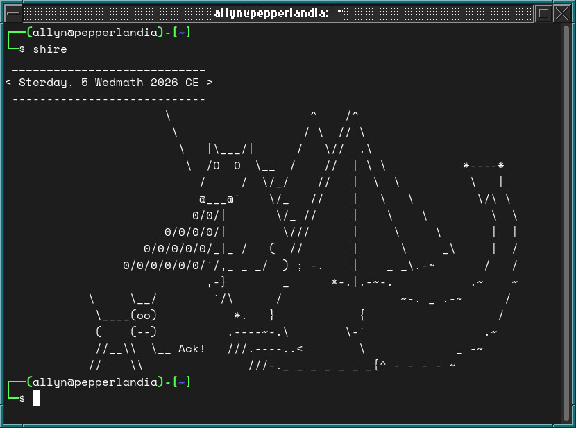

# Shire Reckoning
## A Python command line utility for Hobbits

In the autumn of 1999, I reread _The Lord of the Rings_ and, for the first time, really studied the Appendices. Appendix D explores the calendars of Middle-earth, and it goes into some detail about the calendar in use in the Shire in the late Third Age.

I wrote a BASIC program that would convert a date into a Hobbit-style date. It wasn’t especially useful, but it was a nice little puzzle. A few years later I rewrote the program in PHP and built it into a WordPress plugin, and a few years after that, when I was writing VBA code at Diamond, I wrote a VBA version as well that would drop a Hobbit-style date into a Word document or Excel spreadsheet cell.

“Why don’t I rewrite this in Python?” I wondered. “It might make a nice, if silly, command line tool. Maybe even wrap it in a GTK framework.”

So that’s what I did.

The BASIC code was brutalist. It did what it needed to do. It worked. But it was engineered for function, not form. What it did it did in an ugly way.

The Python code... it’s better engineered. There’s still some brutalism to it — some things about the Shire calendar, like the days that exist outside of months, require direct handling — but it’s cleaner. Things I had done manually in BASIC, like calculating the day of the year, Python has functions for. Python can do the work.

The Python program in this reposity, `shire-reckoning.py` is the important piece. Run `python3 shire-reckoning.py` in your terminal, and you will get the current date according to the Shire calendar.

Careful observers will note that, for instance, Frodo and Bilbo's birthday, given as September 22 in _The Lord of the Rings_, falls earlier in September by the Gregorian calendar, specifically September 11.  This is because the start of the Hobbit calendar year falls in the middle of our December, and the Hobbit's Mid-year Day corresponds to the summer solstice.

But getting the date, I decided, was not enough.

The silly Linux command line utilty `cowsay` prints in the terminal an ASCII cow with a speech bubble. With a command line switch, I could also have other animals, Darth Vader, even Hello Kitty say things in the speech balloon.

Cowsay comes with a dragon. _Two_ dragons, actually. One with a very alarmed cow.

First I came up with a bash alias that would pipe `shire-reckoning.py`'s output into `cowsay`. Then I thought of a better option as it would add more variability, from a randomly chosen dragon to different phrases, in the output.

Linux Mint 5 came with a program called `mint-fortune`. It was a wrapper for `cowsay` that would pick a random cow and have it either _say_ or _think_ a random fortune. It was a bash script, simple enough to modify, and then I could have a random dragon (with or without cow) that would tell the current date in, variously, Hobbiton, Bywater, even Michel Delving.

That's what `shire.sh` does. It is `mint-fortune` reworked for dragons and Shire dates.

I could have written a GTK framework, but honestly, having an ASCII fire-breathing dragon tell me the current date in Hobbiton is _way_ cooler. :)
